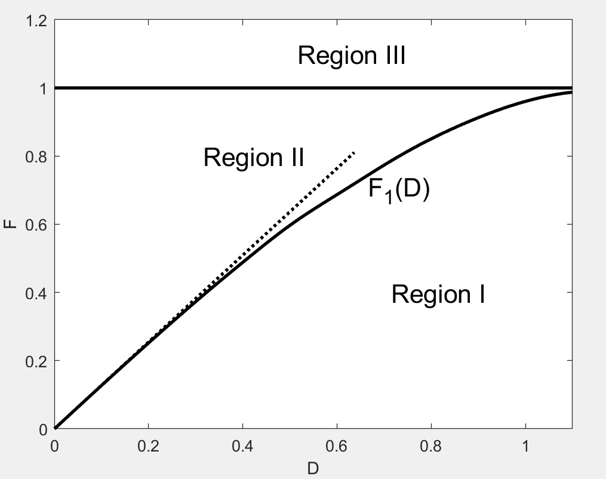

# simb_para_space
 This program is written to illurstrate the bifurcation of the single machine infinite bus (SMIB) system.

```matlab
% -----------------------------------------------------------------------
% Copyright (c) 2011-2020 by Keyou Wang (wangkeyou@sjtu.edu.cn)
% 
% Description:
%  This program is written to draw the bifurcation of the single
%  machine infinite bus (SMIB) system.
%
%  The parameter space will be illustrated as shown in ref[1] after run this script. 
%  
%  If you are interested in the theory of the program. You are recommended
%  to read my paper [2] or other books or papers on dynamical systems as
%  follows.
%   
% See reference:
% [1]. 齐琛，汪可友，吴盼，李国杰，虚拟同步机功角稳定的参数空间分析,中国电机工程学报，2019
% [2]. K.Wang, M.L.Crow,The Fokker-Planck Equation for Power System Stability
%       Probability Density Function Evolution,IEEE Transactions on Power Systems, 2013
% [3]. A. A. Andronov, A. A. Vitt, and S. E. Khaikin, Theory of Oscillators.
%       New York: Dover, 1966.
```
<center></center>
